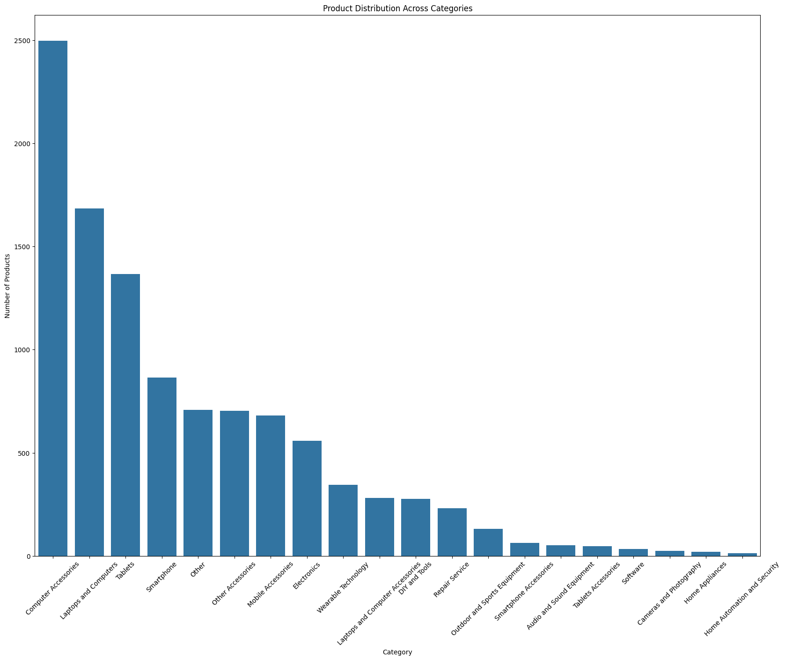
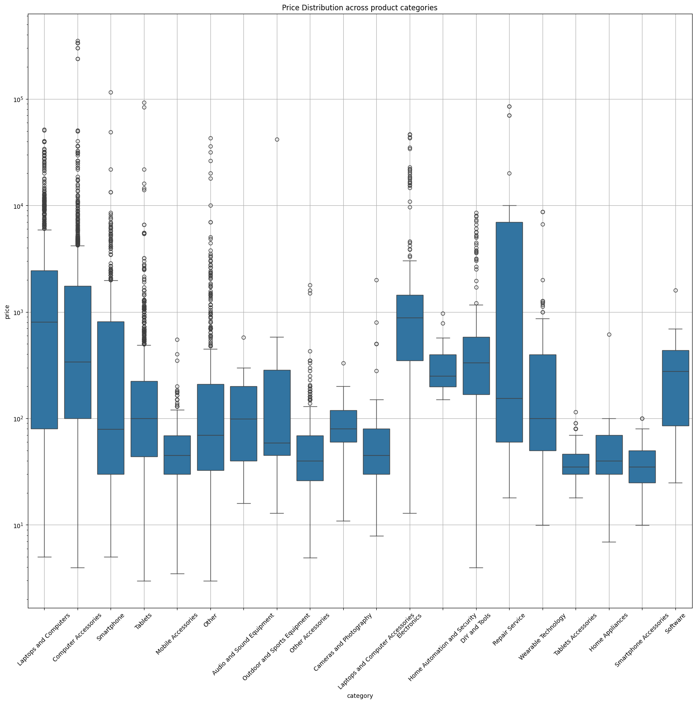

# Data Cleaning and Storytelling with Pandas 

A company has high hopes put into the possibilities that come with Data Analysis, and they are especially hopeful that your work can finally settle an ongoing debate: whether or not it’s beneficial to discount products.

The Marketing Team Lead is convinced that offering discounts is beneficial in the long run. 

The main investors in the Board are worried about offering aggressive discounts. They have pointed out how the company’s recent quarterly results showed an increase in orders placed, but a decrease in the total revenue. 

## Data Source

For this analysis, I will use four tables, which consist of data regarding brands, orderliness, orders, and products. 

## Objective 

The main question the company wants to answer is whether discounting products is beneficial. The data was further cleaned with Pandas, and the SeaBorn library was used to produce graphs. 

## Project's folder structure

* /presentation: contains a pdf file with the presentation of this project
* /data: contains the original and modified brands.csv, orderlines.csv, orders.csv, products.csv.
* /plots: project's plots.

## Some Questions to be answered 

* How should products be classified into different categories to simplify reports and analysis?
* What is the distribution of product prices across different categories?
* How many products are being discounted?
* How big are the offered discounts as a percentage of the product prices?
* How do seasonality and special dates (Christmas, Black Friday) affect sales?
* How could data collection be improved?

## Plots 

Product category and product distribution graph.

## Findings

* Focus on seasonal (Black Friday/Christmas) discounts.
* January discounts make sense.
* All-year discounts have low impact on sales.
* Unproportionatly high number of orders with status "Shopping Basket". Further reasearch needed.

